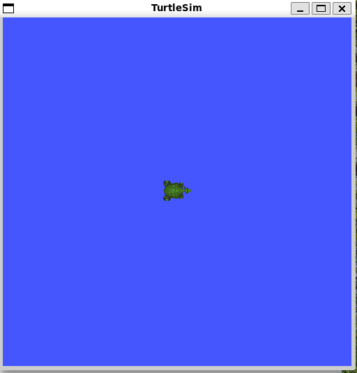
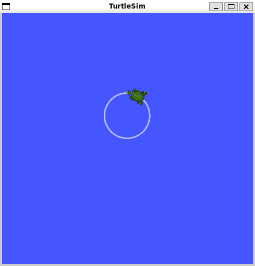
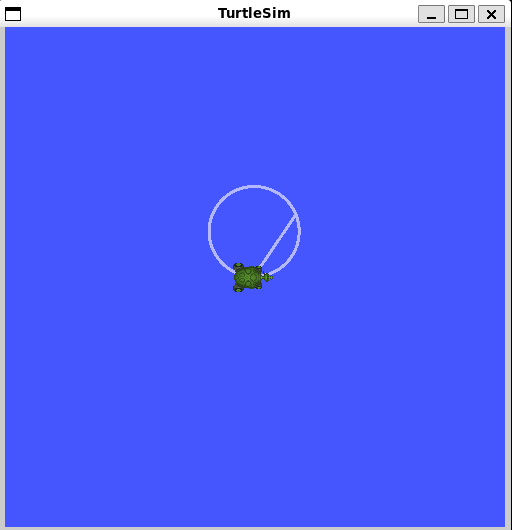

# AI4 – Manipulate `turtlesim` in ROS 2 (Humble)

This repo shows how to install ROS 2 Humble on Ubuntu 22.04, run `turtlesim`, manipulate the turtle via topics/services/params, and launch a custom Python node. All steps are reproducible.

## Prerequisites
- Ubuntu 22.04 (VM or bare metal)
- ROS 2 Humble
- Python 3.10

## Install ROS 2 Humble + turtlesim
```bash
sudo apt update
sudo apt install -y curl gnupg2 lsb-release
sudo apt install -y ros-humble-desktop
echo "source /opt/ros/humble/setup.bash" >> ~/.bashrc
source ~/.bashrc
sudo apt install -y ros-humble-turtlesim


## Screenshots

### Turtlesim App


### Move the Turtle with /cmd_vel


### Teleport Absolute (service call)


### Spawn Another Turtle (service call)


